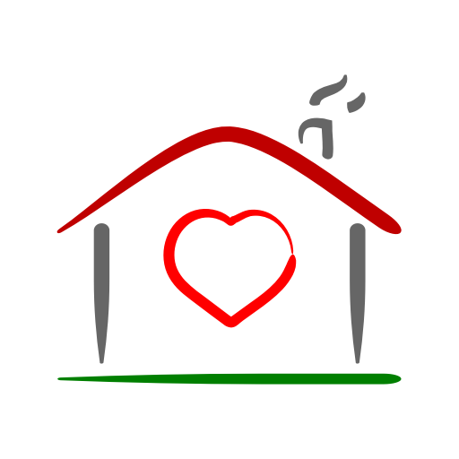

# 📖 1. Landing Page

NGO Adobe House Whitepaper v\_2

<figure><figcaption></figcaption></figure>

**Brief Description:**

\
Welcome to the NGO Adobe House Whitepaper.&#x20;

Dive into our detailed overview to understand our vision, the transformative utility of our token, and the roadmap we envision to change the landscape of modern education.

#### Entity Information & Contact:

**Entity Name:** Association Casa din Chirpici (NGO Adobe House)

**Incorporation Details:**\
Registered in Romania, County Bihor, Town: Oradea\
Registration No: 1874/A/2021\
TAX Number: 44437199

**Physical Address:**\
Oradea, County Bihor, Romania

**Contact Information:**\
📧 Email: [Office@adobehouse.org](mailto:Office@adobehouse.org)

**Social Media & Online Presence:**\
🌐 Official Website: [https://adobehouse.org](https://adobehouse.org)\
🐦 Twitter: [NGOAdobeHouse](https://twitter.com/NGOAdobeHouse)\
💬 Discord: [AdobeHouse Discord](https://discord.com/invite/GCzBdPtyN4)\
🔗 GitHub: [NGOAdobeHouse](https://github.com/NGOAdobeHouse/token)\
📹 YouTube: [AdobeHouseNGO](https://youtube.com/@AdobeHouseNGO)\
📸 Instagram: [ngoadobehouse](https://www.instagram.com/ngoadobehouse/)\
🔗 LinkedIn: [NGO Adobe House](https://www.linkedin.com/company/ngo-adobe-house)
